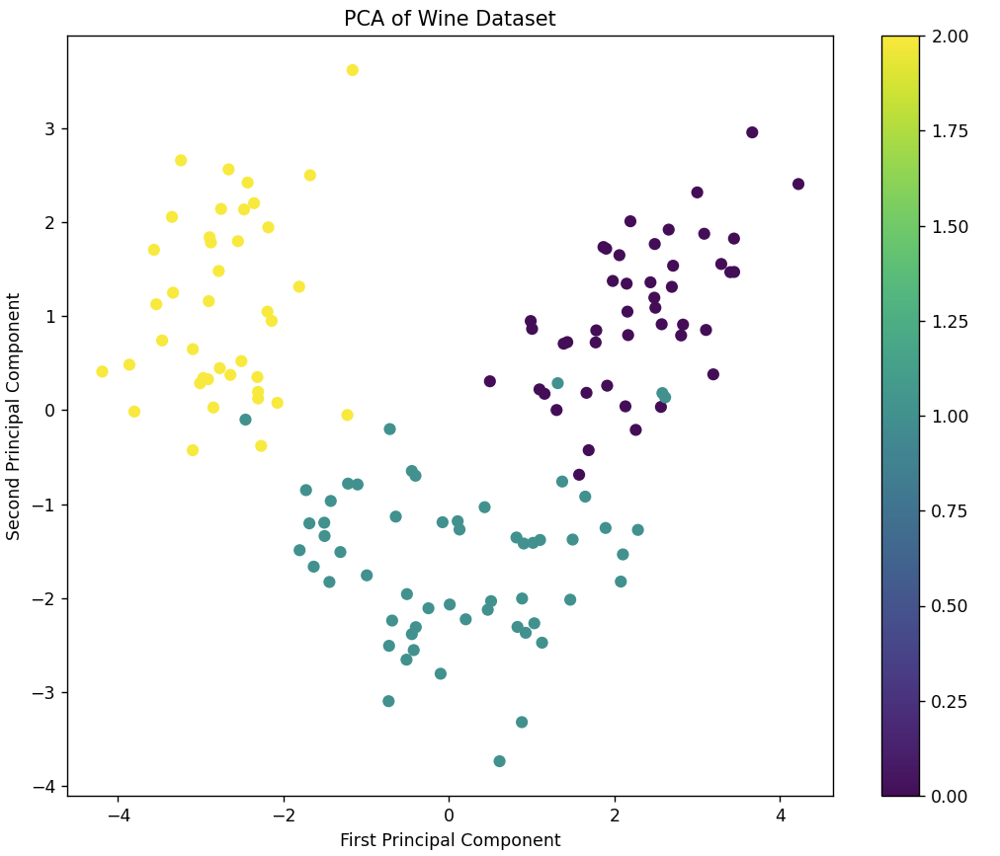

# Wine Model Comparison

Comparison of 5 classification techniques for predicting wine types using the [Wine Dataset](https://archive.ics.uci.edu/dataset/109/wine) from the UCI Machine Learning Repository. Built as a project for an **Artificial Intelligence** course, the analysis covers the full ML pipeline: data scaling, model training with grid search, cross-validation, and evaluation through accuracy, classification reports, confusion matrices, and ROC AUC curves.

The dataset contains 178 wine samples from three Italian cultivars, each described by 13 chemical properties (alcohol, malic acid, flavonoids, color intensity, proline, etc.). The goal is to classify each sample into one of the three cultivar classes.

<div align="center">
  
  <br>
  <em>PCA projection showing clear cluster separation across the three wine classes</em>
</div>

## Results

| Model | Accuracy | AUC ROC | Precision | Recall | F1-Score |
|-------|----------|---------|-----------|--------|----------|
| **SVM** | **100%** | **1.0000** | 1.00 | 1.00 | 1.00 |
| **Random Forest** | **100%** | **1.0000** | 1.00 | 1.00 | 1.00 |
| **Neural Network** | **100%** | **1.0000** | 1.00 | 1.00 | 1.00 |
| KNN | 94.44% | 0.9995 | 0.95 | 0.94 | 0.94 |
| Decision Tree | 94.44% | 0.9521 | 0.94 | 0.95 | 0.94 |

SVM, Random Forest, and Neural Network achieved perfect classification. KNN and Decision Tree reached 94.44% accuracy, with minor misclassifications concentrated in class 1. A paired t-test between KNN and SVM showed no statistically significant difference (p > 0.05).

## Models

- **K-Nearest Neighbors (KNN)** — Non-parametric classifier based on proximity to the k closest neighbors. Sensitive to the choice of k and feature scaling, but effective for small datasets with non-linear boundaries.

- **Support Vector Machine (SVM)** — Finds the optimal hyperplane maximizing margin between classes. Kernel functions handle non-linear separability. Robust against overfitting with limited samples.

- **Decision Tree** — Hierarchical splits based on feature thresholds. Highly interpretable but prone to overfitting without pruning. No normalization required.

- **Random Forest** — Ensemble of decision trees trained on random feature/data subsets. Reduces variance and overfitting compared to a single tree while maintaining interpretability.

- **Neural Network (MLP)** — Multi-layer perceptron with backpropagation. Flexible enough to model complex non-linear relationships. Uses SoftMax activation for multi-class output.

## Dataset

| Property | Value |
|----------|-------|
| Source | [UCI Machine Learning Repository](https://archive.ics.uci.edu/dataset/109/wine) |
| Samples | 178 |
| Features | 13 (alcohol, malic acid, ash, alkalinity, magnesium, phenols, flavonoids, nonflavanoid phenols, proanthocyanins, color intensity, hue, OD280/OD315, proline) |
| Classes | 3 cultivars (59 / 71 / 48 samples) |
| Missing values | None |

## How it works

1. Load the Wine Dataset from scikit-learn
2. Scale features with `StandardScaler` for consistent ranges
3. Split into train/test sets (80/20)
4. Train each model with hyperparameter tuning via **grid search + cross-validation**
5. Evaluate: accuracy, classification report, confusion matrix, ROC AUC
6. Compare models with a paired t-test and PCA visualization

## Running it

```bash
pip install -r requirements.txt
python analisis.py
```

**Dependencies:** scikit-learn, matplotlib, seaborn, scipy

## Tech stack

| | |
|---|---|
| **Language** | Python |
| **ML library** | scikit-learn |
| **Visualization** | matplotlib, seaborn |
| **Statistics** | scipy (paired t-test) |

## Context

Built for an **Artificial Intelligence** course at Universidad de Salamanca, 2024. The project explores classification fundamentals: algorithm selection, hyperparameter optimization, model evaluation metrics, and statistical comparison of results.
